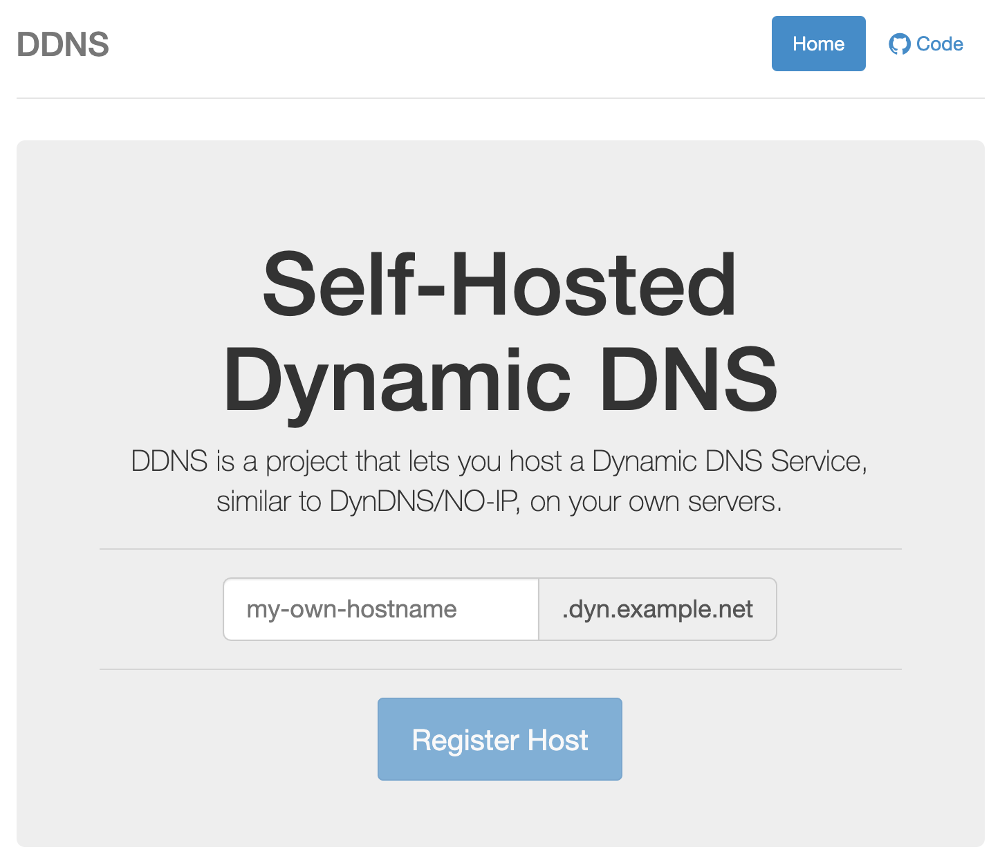

# `ddns` - Dynamic DNS

[](https://circleci.com/github/pboehm/ddns)
[](https://hub.docker.com/r/pboehm/ddns)
[](https://hub.docker.com/r/pboehm/ddns)
[](https://github.com/pboehm/ddns)


A self-hosted Dynamic DNS solution similar to DynDNS or NO-IP based on the
[PowerDNS Remote Backend](https://doc.powerdns.com/md/authoritative/backend-remote/).




## ⚠️⚠️⚠️ Note regarding hosted version at `ddns.pboehm.de`

The hosted `ddns` service with custom hosts under the `d.pboehm.de` domain (e.g `test.d.pboehm.de`) is not available
anymore! I did not use this service for quite some time and recently there were some issues which resulted in downtime
and expiration of all registered hosts.

### Alternatives

There is at least one other hosted version of `pboehm/ddns` that
[can be found via Google](https://www.google.com/search?q=pboehm%2Fddns+%22DDNS+is+a+project+that+lets+you+host+a+Dynamic+DNS+Service%2C+similar+to+DynDNS%2FNO-IP%2C+on+your+own+servers.%22)
or you can host it yourself as described below.

## How can I update my IP if it changes?

`ddns` is built around a small webservice, so that you can update your IP address simply by calling
an URL periodically through `curl`. Hosts that haven't been updated for 10 days will
be automatically removed. This can be configured in your own instance.

An API similar to DynDNS/NO-IP has not been implemented yet.

## Self-Hosting

### Requirements

* A custom domain where the registrar allows setting `NS` records for subdomains. This is important because not all
  DNS providers support this.
* A server with [docker](https://www.docker.com/) and [docker-compose](https://docs.docker.com/compose/) installed
* The following ports should be opened in the firewall:
  * `53/udp`
  * `80/tcp`
  * `443/tcp`

### DNS-Setup

For the domain you want to use with `ddns` (`example.net` in the following sections, please adjust this to your domain)
you have to create the following two DNS records:

* `ddns.example.net` as a `CNAME` or `A`/`AAAA` record pointing to the server `ddns` will be running on. This record
  will be used for accessing the `ddns` frontend in your browser or via `curl`. It is also the target for the
  corresponding `NS` record.
* `d.example.net` as an `NS` record pointing to the previously created `ddns.example.net` record. This will delegate
  all subdomains under `d.example.net` to the PowerDNS server running on `ddns.example.net`.

### `ddns`-Setup

The setup is now automated using [docker-compose](https://docs.docker.com/compose/) and only some customization has
to be made in a `docker-compose.override.yml` file
(a [sample](./docker/docker-compose.override.yml.sample) is available here).

#### Configuring the Setup

The setup included in this repository contains all the components described above and uses
[caddy](https://caddyserver.com/) as a web server, because it provides automatic HTTPS using Lets Encrypt.

```
git clone git@github.com:pboehm/ddns.git
cd ddns/docker
cp docker-compose.override.yml.sample docker-compose.override.yml
```

Please adjust the settings in `docker-compose.override.yml` marked with the `#<<< ....` comments as follows:

* adjust the domain part in lines marked with `# <<< ADJUST DOMAIN` according to your DNS-Setup
* insert your email address in lines marked with `# <<< INSERT EMAIL` which is required for getting certificates
  from Lets Encrypt

Finally execute the following `docker-compose` command, which creates 4 containers in detached mode which are also
started automatically after reboot. For updating an existing installation use the same command because it automatically
rebuilds the containers.

```
docker-compose --project-name ddns up -d --build
```
